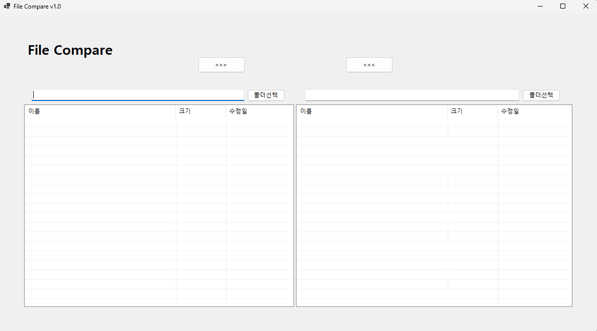
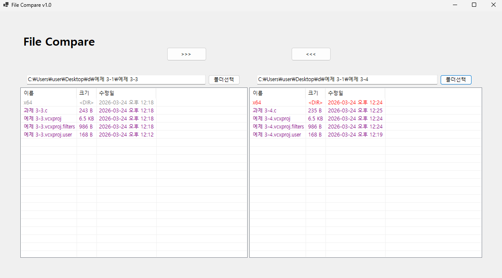
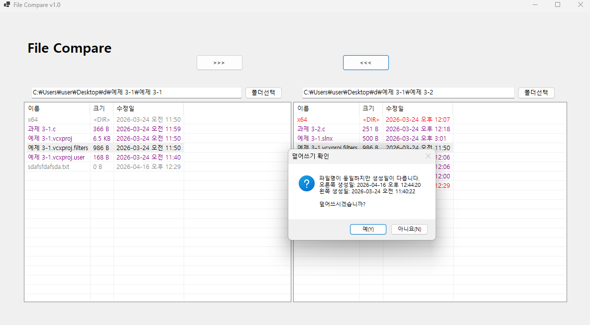
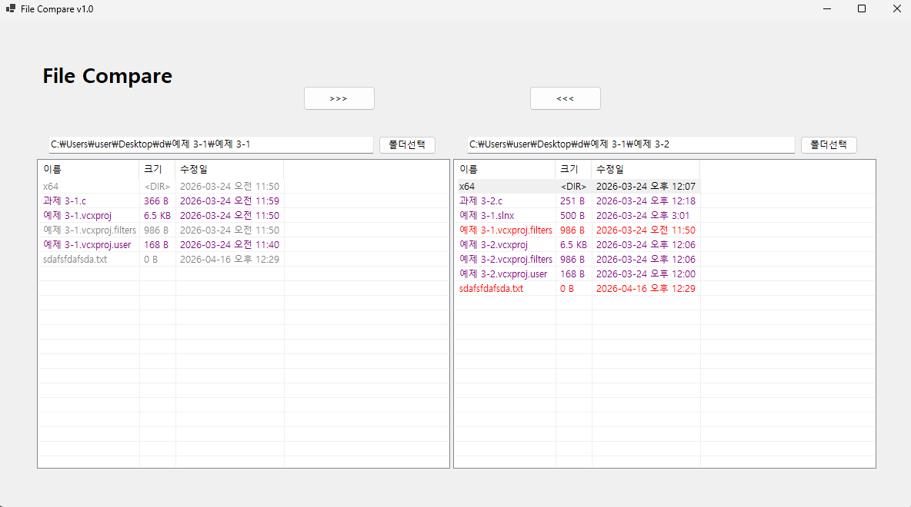

# (C# 코딩) File Compare 

## 개요

- C# 프로그래밍 학습
- 1줄 소개: 사용자가 두 개의 폴더를 선택하면 파일 및 폴더를 비교하고 차이를 색상으로 표시하며 복사 기능을 제공하는 프로그램

- 사용한 플랫폼: C#, .NET Windows Forms, Visual Studio, GitHub

- 사용한 컨트롤: Label, TextBox, Button, ListView, FolderBrowserDialog

- 사용한 기술과 구현한 기능:
	- Visual Studio를 이용하여 UI 디자인
	- System.IO를 활용한 파일 및 디렉터리 탐색 기능 구현
	- ListView를 이용한 파일/폴더 목록 출력 및 정렬 처리
	- 파일 이름과 생성 시간을 기준으로 비교 로직 구현
	- 조건문(if, else)을 활용한 파일 상태 구분 (동일 / 변경 / 단독 존재)
	- 색상(Color)을 활용하여 비교 결과를 시각적으로 표시
	- 동일: 검정
	- 변경됨: 회색(왼쪽) / 빨강(오른쪽)
	- 단독 존재: 보라색

## 실행 화면

- 코드의 실행 스크린샷과 구현 내용 설명

  

- 구현한 내용 (위 그림 참조)
	- UI 디자인: Label, TextBox, Button, ListView 컨트롤을 이용하여 폴더 선택 및 비교 결과 출력 인터페이스 구성
	- 파일 및 폴더 표시를 할 ListView 컨트롤을 추가하여 비교 결과를 시각적으로 표현할 수 있느 환경을 구성함

## 실행 화면

- 코드의 실행 스크린샷과 구현 내용 설명
  
  
  

- 구현한 내용 (위 그림 참조)
	- 폴더를 선택할 수 있는 기능을 추가함
	- 선택한 폴더의 파일 및 폴더를 ListView에 표시하고 비교 결과를 색상으로 시각화함

## 실행 화면

- 코드의 실행 스크린샷과 구현 내용 설명
  
  
  
	- 구현한 내용 (위 그림 참조)
		- 복사기능을 추가하여 사용자가 선택한 파일을 다른 폴더로 복사할 수 있도록 구현함
		- ListView에서 파일을 선택하면 복사 버튼이 활성화되고, 클릭하면 복사함
		- 파일 명은 같으나 만든 시각이 다른 경우 변경된 파일로 간주하여 빨간색으로 표시함
		
## 실행 화면

- 코드의 실행 스크린샷과 구현 내용 설명
  
  
  

- 구현한 내용 (위 그림 참조)
	- 폴더에도 같은 사항이 적용되도록 만들어 아래에 있는 폴더에도 복사가 가능하도록 만들었음.
	- 폴더 내부의 파일도 같이 비교할 수 있는 기능을 구현완료 함.

